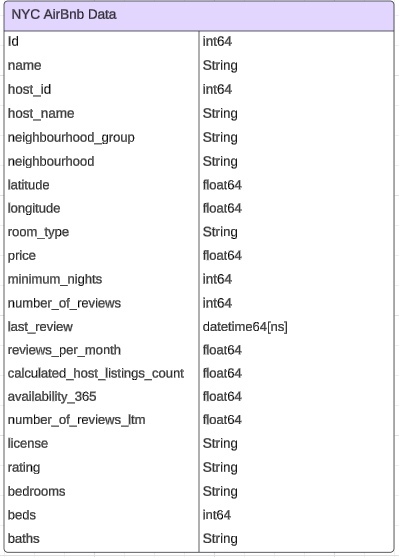
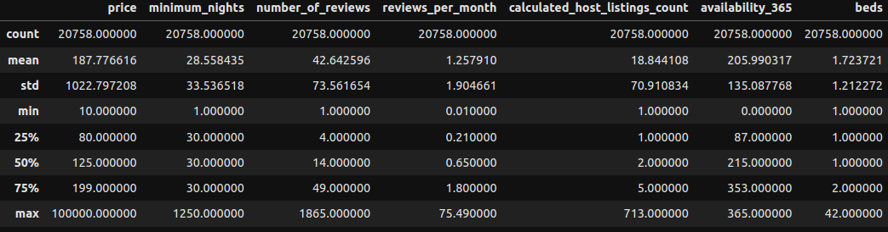
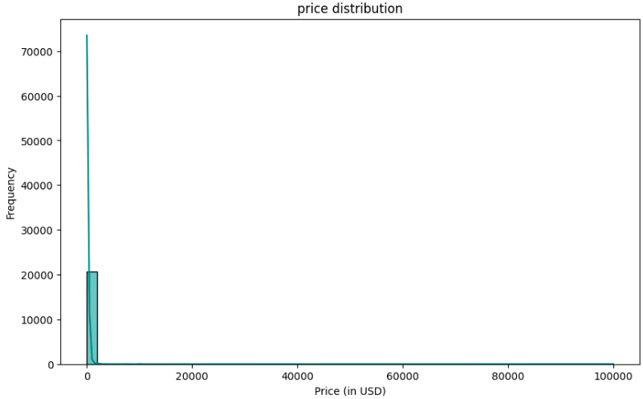
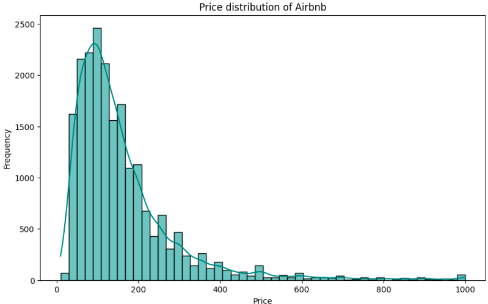
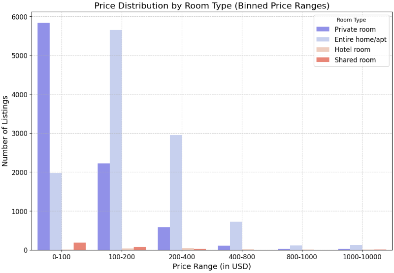
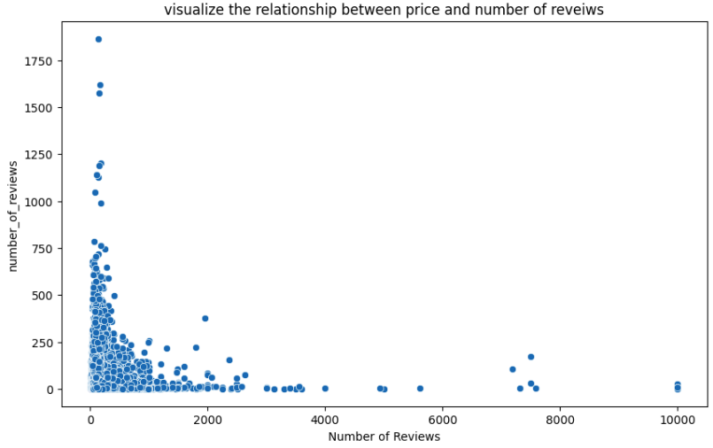

# NYC Airbnb Data Analysis 
This project is focused on acquiring NYC datasets, performing data cleaning, and analyzing the information to address key business questions. By visualizing the findings, we aim to deliver comprehensive insights and actionable results to support the decision-making needs of the business department. 

# project overveiw
- purpose: Analyzing NYC datasets to deliver insights for business decision-making.

# Data structure overview
- description: This dataset contains all the information needed about the New York Airbnb listings.
It contains useful features such as latitude, longitude, room type, price, ratings, bedrooms, beds, baths, among others.
- access: This data is accessible through this repository, but you can also find it on Kaggle and access it via an API if preferred.

## executive summary
**overview of finding**
after cleaning and formating our data we preform some exploratory data analysis to have an ideas about 
how our data is distributed like the price distribution and also understand other statistical metrics using the describe mthode
that help ud to have a deep insight of our data 
bellow we have some visualization from some pythone libararies like seaborn matplotlib:

 

Now let's dive into the results of the `describe()` function and the metrics we have in front of us, to gain a better understanding of the characteristics of this dataset:

 **Price**:
- The average price of an Airbnb listing in New York City is around **\$188** per night.
- However, there’s a **wide variation** in prices, with some listings costing as low as **\$10** and some reaching extreme outliers of **\$100,000** (likely luxury or unique properties).
- The high standard deviation (**\$1022.80**) indicates that while most listings are in the lower range, a few **very high-priced listings** skew the data.

**Minimum Nights**:
- On average, hosts require a minimum stay of around **28 nights**, which is relatively high. This suggests that some listings are targeting **longer-term stays**.
- While some listings allow **1-night stays**, others require a minimum stay of **1250 nights**, indicating long-term rental options for certain properties.

**Number of Reviews**:
- The average listing has received around **43 reviews**. However, this varies significantly, with some listings having only **1 review**, while others have up to **1865 reviews**, reflecting the popularity and frequency of bookings.

 **Reviews Per Month**:
- On average, listings receive **1.26 reviews per month**, which suggests consistent booking activity.
- Some listings receive as many as **75 reviews per month**, indicating extremely high turnover and popularity.

**Host Listings**:
- On average, hosts manage **18.8 listings**, which suggests that many hosts on the platform are **professional property managers**.
- Some hosts manage only **1 listing**, typical of individual hosts, while the most active hosts manage up to **713 listings**, likely indicating commercial hosts.

**Availability (365 Days)**:
- Listings are available for an average of **206 days per year**, meaning many listings are booked or unavailable for a portion of the year.
- Some listings are available for **365 days** a year, while others are fully booked (or unavailable) for the entire year.

**Beds**:
- The average listing offers **1.72 beds**, indicating that many properties are small, likely **1-bedroom apartments or studios**. The maximum number of beds in a listing is **42**, suggesting that there are some large, group-oriented properties.

In this plot, we attempted to visualize the full distribution of Airbnb listing prices. However, we can see that the vast majority of prices are clustered near $0, while the x-axis extends all the way up to \$100,000. This is because there are some extremely high-priced listings (outliers) that skew the distribution and compress the visual representation of most listings. As a result, the bulk of listings, which are priced much lower, are squeezed into a very narrow section of the plot, making it difficult to see meaningful trends.

To solve this, we will apply a price cap and only consider listings with prices up to \$1000 to get a clearer view of the price distribution for the majority of listings.

In this second plot, we restricted the dataset to only include listings priced at \$1000 or below, which represents the vast majority of listings. As a result, we can now see a more detailed distribution:

Most listings fall within the \$50 to \$300 range, with a peak around \$150 per night.
The distribution is right-skewed, meaning that while there are many affordable listings, a small number of higher-priced listings are still present.
This plot gives a much clearer view of the typical prices for Airbnb listings in New York City, without the distortion caused by a few extreme outliers.

To improve clarity in our analysis moving forward, we will address these outliers by applying a price cap and filter on our data, allowing us to focus on the majority of Airbnb listings.

The majority of Airbnb listings are concentrated in the lower price ranges, particularly for **private rooms** and **entire homes/appartments**. This reinforces the notion that Airbnb is largely a platform for more affordable, short-term stays. As prices increase, the number of listings decreases significantly, with only a few high-end listings surpassing **$1000 USD**.

**bold text**###**4.3. Relationship Between Price and Number of Reviews**

# The scatter plot shows that:

- **Lower-priced listings** (below $1,000 USD) tend to have more reviews, with many reaching over 500 reviews. This suggests that affordable listings are booked more often, leading to more reviews.

- **Higher-priced listings** (above $2,000 USD) generally have fewer reviews, indicating that luxury or high-cost properties are booked less frequently, possibly catering to a more selective audience.

Which means : There is an **inverse relationship** between **price** and the number of **reviews**: cheaper listings get more reviews, while expensive listings tend to have fewer.

##  Recommendation

